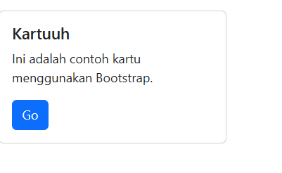

# Latihan Bootstrap


Halo halo, ini adalah lanjutan dari [Html dasar](https://github.com/laLafid/Lab1Web), [CSS dasar](https://github.com/laLafid/lab2web), [CSS](https://github.com/laLafid/Lab3Web), [CSS Layout](https://github.com/laLafid/Lab4Web) dan [Dasar Javascript](https://github.com/laLafid/Lab5Web)
Sekarang disini akan mencoba menggunakan Bootstrap.

## Langkah-langkah

1. **Siapkan Editor**
    - Misal Visual Studio Code.
    

2. **Buat kerangka baru**
    - Buat file baru `eindex.html` dan masukkan struktur HTML dasar dengan bootstrap:
    

    ```html
    <!DOCTYPE html>
    <!DOCTYPE html>
    <html lang="en">
    <head>
        <meta charset="UTF-8">
        <meta name="viewport" content="width=device-width, initial-scale=1.0">
        <title>Lab 6 Bootstrap</title>
        <link href="https://cdn.jsdelivr.net/npm/bootstrap@5.3.8/dist/css/bootstrap.min.css" rel="stylesheet" integrity="sha384-sRIl4kxILFvY47J16cr9ZwB07vP4J8+LH7qKQnuqkuIAvNWLzeN8tE5YBujZqJLB" crossorigin="anonymous">
    </head>
    <body>
        <div class="container">
            <h1>Halo, Bootstrap!</h1>
            <button class="btn btn-primary">Ini Tombol Bootstrap</button>
        </div>
    </body>
    <script src="https://cdn.jsdelivr.net/npm/bootstrap@5.3.8/dist/js/bootstrap.bundle.min.js" integrity="sha384-FKyoEForCGlyvwx9Hj09JcYn3nv7wiPVlz7YYwJrWVcXK/BmnVDxM+D2scQbITxI" crossorigin="anonymous"></script>
    </html>
    ```

3. **eBoootstrap**

    - Membuat Kolom
    

    ```html
    <div class="row">
        <div class="col-4">Kolom 1</div>
        <div class="col-4">Kolom 2</div>
        <div class="col-4">Kolom 3</div>
    </div>
    <div class="row">
        <div class="col-md-8">Kolom 4</div>
        <div class="col-md-4">Kolom 5</div>
    </div>
    ```

    - Berbagai macam button yang bisa dipakai
    

    ```html
    <button class="btn btn-primary">Primary</button>
    <button class="btn btn-secondary">Secondary</button>
    <button class="btn btn-success">Success</button>
    <button class="btn btn-danger">Danger</button>
    ```

    - Implement Navbar
    

    ```html
    <nav class="navbar navbar-expand-lg navbar-dark bg-dark">
        <div class="container-fluid">
            <a class="navbar-brand" href="#">Praktikum 6</a>
            <button class="navbar-toggler" type="button" data-bs-toggle="collapse" data-bs-target="#navbarNav" aria-controls="navbarNav" aria-expanded="false" aria-label="Toggle navigation">
                <span class="navbar-toggler-icon"></span>
            </button>
            <div class="collapse navbar-collapse" id="navbarNav">
                <ul class="navbar-nav">
                    <li class="nav-item">
                        <a class="nav-link active" aria-current="page" href="#">Home</a>
                    </li>
                    <li class="nav-item">
                        <a class="nav-link" href="#">Artikel</a>
                    </li>
                </ul>
            </div>
        </div>
    </nav>
    ```

    - Kasih Kartuu, macam menu top-up
    

    ```html
    <div class="card" style="width: 18rem; margin-top:20px;">
        <div class="card-body">
            <h5 class="card-title">Kartuuh</h5>
            <p class="card-text">Ini adalah contoh kartu menggunakan Bootstrap.</p>
            <a href="#" class="btn btn-primary">Go</a>
        </div>
    </div>
    ```

    - Coba form
    

    ```html
    <div class="mb-3">
        <label for="emailInput" class="form-label">Alamat Email</label>
        <input type="email" class="form-control" id="emailInput" placeholder="nama@contoh.com">
    </div>
    <div class="mb-3">
        <label for="pesanText" class="form-label">Pesan</label>
        <textarea class="form-control" id="pesanText" rows="3"></textarea>
    </div>
    <button type="submit" class="btn btn-primary">Kirim</button>
    ```

4. **Hasil Akhir**
    
    *bdum tsss

    
## Akhri Kata
Di bawah ini 
    [Layout4 Pakai Bootstrap](lab6_bootstrap/index.html)
    [](gambar/Layoutmod.png)
    [FormButton Pakai Bootstrap](lab6_bootstrap/form.html)
    [](gambar/FormButton.png)
    [Portfolio Pakai Bootstrap juga](lab6_bootstrap/about.html)
    [](gambar/port.png)

*Selamat mencoba*
